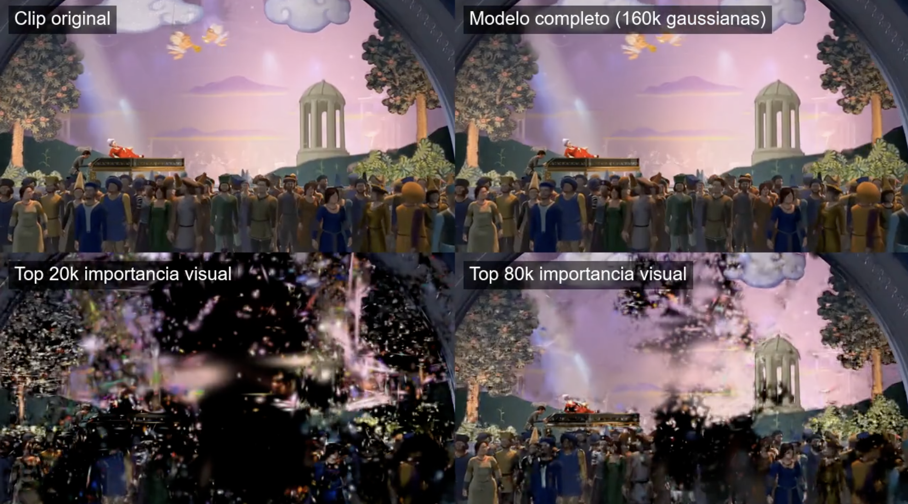
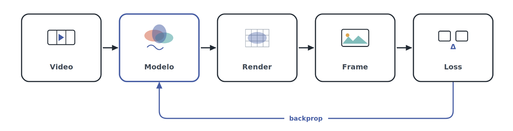
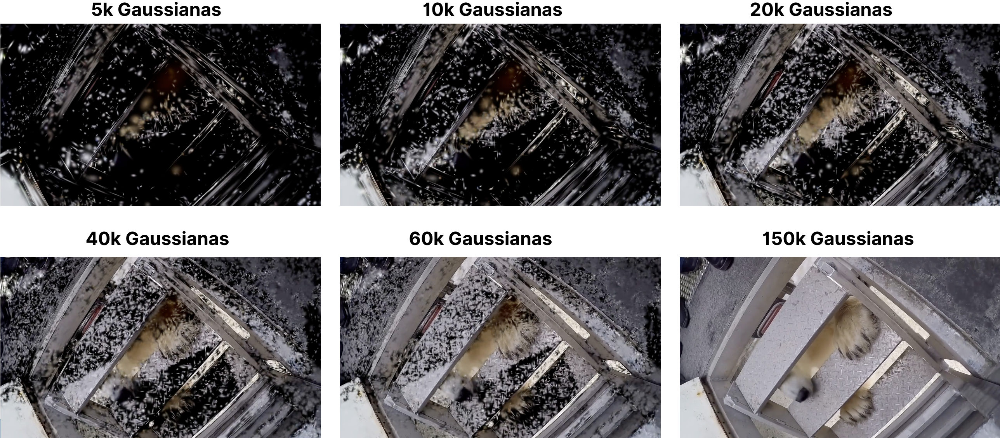

<div align="center">

# MBB-GS: Moving Gaussians

### Multimedia Representation with 2D Gaussian Splatting

[Jose Leandro Machaca Soloaga](https://github.com/JLeandroJM) &nbsp;·&nbsp;
[Mauro Ianfranco Bobadilla Castillo](https://github.com/MauBC) &nbsp;·&nbsp;
[Eric Biagioli](https://github.com/ericbiagioli)

**Universidad de Ingeniería y Tecnología (UTEC)**

[](#citation)
[](https://drive.google.com/drive/folders/1N1kAQ0xZ2nKvp4y3VfURjVassB7x6bnB?usp=drive_link)
[](wiki/Home.md)
[](LICENSE)
[](https://www.python.org)
[](https://pytorch.org)



<p><i>The original clip and its reconstruction from Chebyshev coefficients are hard to tell apart. Below, the same model rendered with only its most important Gaussians: the representation is explicit enough to ask which primitives carry the image.</i></p>

</div>

---

A video is usually stored as a sequence of independent frames. That format is
convenient for playback, but it says nothing about *how* the visual content
changes over time.

**MBB-GS represents a video as a fixed population of 2D Gaussians whose
attributes are continuous functions of time.** The model stores polynomial
coefficients, not frames, so the video becomes a signal that can be evaluated at
any instant — including instants that were never recorded. As a complementary
extension, the same philosophy is applied to audio with Gabor atoms.

Two properties follow directly from this design. **Temporal interpolation is
free**: evaluating the trained model between two original frames needs no second
network, no optical flow and no extra training. And **the model can be pruned
and quantised after training**, because each Gaussian owns an explicit,
inspectable set of coefficients.

## Table of contents

- [Method](#method)
- [Results](#results)
- [Installation](#installation)
- [Quick start](#quick-start)
- [Usage](#usage)
- [Repository structure](#repository-structure)
- [Reproducing the paper experiments](#reproducing-the-paper-experiments)
- [Tests](#tests)
- [Data and heavy results](#data-and-heavy-results)
- [Documentation](#documentation)
- [Citation](#citation)
- [License](#license)

## Method

<div align="center">

</div>

Training is a single differentiable loop. A frame is rendered from the model,
compared against the original, and the gradient flows back through the
rasteriser into the polynomial coefficients. There is no network anywhere in
that loop — the coefficients *are* the model.

A single set of $N$ Gaussians is kept for the entire clip. Nothing is created or
destroyed between frames. Each attribute $p$ of each Gaussian $i$ — position,
opacity, colour, scale, rotation and depth — is a Chebyshev polynomial in
normalised time $\tau(t) \in [-1, 1]$:

$$p_i(t) = a_{i,0}^{(p)} + \sum_{k=1}^{K_p} a_{i,k}^{(p)} \, T_k(\tau(t))$$

To render frame $t$ the polynomials are evaluated and the resulting Gaussians
are fed to a differentiable CUDA rasteriser:

$$t \longrightarrow \tau(t) \longrightarrow G(t) \longrightarrow \hat{I}(t)$$

Each attribute gets its own degree $K_p$, because they do not need the same
temporal capacity: position and opacity change a lot, depth and rotation usually
do not. A production configuration uses degrees 100 / 80 / 30 / 12 / 6 / 4 for
`mu` / `opacity` / `color` / `scale` / `theta` / `depth`.

Chebyshev is the main basis: it is bounded on $[-1, 1]$ and well conditioned at
high degree, which matters at those degrees. A monomial basis is kept only for
the ablation that motivates the choice, and to load older checkpoints.

Because every primitive owns an explicit trajectory $\mu_i(t)$, the model can
be inspected directly: which Gaussians move, how far, and when. The scripts in
`scripts/visualization/` draw exactly that.

For the details, see
[Model and Temporal Representation](wiki/Model-and-Temporal-Representation.md)
and [CUDA Rasterizer](wiki/CUDA-Rasterizer.md).

## Results

Every number below is read from a record committed under `results/`, or noted as
living on the Drive. Full tables and settings: [Results](wiki/Results.md).

**Loss ablation** — 600 frames, 720p, 100k Gaussians, 800 epochs. Weighting the
error towards moving regions wins on every metric:

| Loss | PSNR ↑ | PSNR min ↑ | SSIM ↑ | LPIPS ↓ | Temporal PSNR ↑ |
| --- | ---: | ---: | ---: | ---: | ---: |
| Baseline (L1 + DSSIM) | 31.83 | 28.10 | 0.962 | 0.0594 | 35.17 |
| Edge | 31.88 | 28.05 | 0.963 | 0.0574 | 35.23 |
| Temporal | 31.93 | 28.32 | 0.963 | 0.0588 | 35.32 |
| **Motion** | **33.24** | **30.32** | **0.965** | **0.0483** | **36.88** |

**Temporal basis** — a deliberately small setting (8k Gaussians, 120 frames at
160×160, 360 epochs, degree 30 for `mu`) that isolates the effect of the basis:

| Basis | PSNR ↑ | PSNR min ↑ | SSIM ↑ | Temporal PSNR ↑ |
| --- | ---: | ---: | ---: | ---: |
| Monomial | 23.16 | 20.19 | 0.750 | 30.61 |
| **Chebyshev** | **29.95** | **27.70** | **0.926** | **34.04** |

**Frame aggregation** — the exponent $q$ that combines per-frame errors. Quality
falls monotonically, so the uniform average is the right choice:

| $q$ | PSNR ↑ | PSNR min ↑ | SSIM ↑ | LPIPS ↓ |
| ---: | ---: | ---: | ---: | ---: |
| **1** | **33.24** | **30.02** | **0.964** | **0.048** |
| 2 | 29.77 | 27.43 | 0.942 | 0.099 |
| 4 | 21.19 | 16.84 | 0.859 | 0.336 |
| 8 | 14.70 | 13.37 | 0.517 | 0.821 |

**Capacity** — the same frame reconstructed with a growing population. At low
counts the Gaussians cannot cover the frame and the render breaks into speckle;
the coverage closes progressively, and at 150k the reconstruction is clean:

<div align="center">

</div>

**Model reduction** — from 150k Gaussians on 750 frames at 720p, adaptive
pruning to 120k Gaussians followed by UINT16 quantisation takes the model from
about 236 MB to 85 MB, at roughly 63 dB PSNR against the full reconstruction: a
2.8× reduction at a difference that is effectively invisible.

**Audio** — 9 s of stereo at 44.1 kHz with 160k Gabor atoms in Mid-Side reaches
27.78 dB SNR and 27.77 dB SI-SDR.

**The recipe.** The final video configuration is the `motion` loss with
`lambda_motion: 2.0`, `lambda_dssim: 0.25` and `exponente_frame: 1`.

## Installation

### Hardware requirements

- CUDA-ready NVIDIA GPU. 8 GB of VRAM is enough for 720p with 100k Gaussians in
  streaming mode
- The reported runs used 32–64 GB of system RAM, since frames are held on CPU
- No GPU is needed for the tests, checkpoint inspection or metrics on existing
  frames

### Software requirements

- Python 3.10 or newer
- PyTorch with CUDA, and a C++ compiler compatible with that build
- CUDA Toolkit matching the PyTorch build — 12.6 for the reported runs
- FFmpeg and FFprobe on `PATH`, for video and audio extraction
- 7-Zip, optional, only to losslessly compress the final packaged models

### Setup

```bash
git clone https://github.com/JLeandroJM/MBB-GS-Moving-Gaussians.git
cd MBB-GS-Moving-Gaussians

conda create -n mbb-gs python=3.10 -y
conda activate mbb-gs

# For a GPU environment, install PyTorch from the CUDA index first
pip install torch --index-url https://download.pytorch.org/whl/cu126

pip install -r requirements.txt
pip install -e .
```

**`pip install -e .` is not optional.** The scripts import `gs2d_video` and
`gs2d_gabor` as installed packages and do not patch `sys.path`. Without it every
script fails with `ModuleNotFoundError: No module named 'gs2d_video'`.

Check that PyTorch sees the GPU before compiling anything:

```bash
python -c "import torch; print(torch.__version__, torch.version.cuda, torch.cuda.is_available())"
```

### CUDA extensions

Compiled binaries are tied to a specific Python ABI and CUDA build, so they are
not versioned and must be built in each environment:

```bash
# video rasteriser — required for training
cd cuda/raster_cuda && python setup.py build_ext --inplace && cd ../..

# Gabor audio — only needed for the audio extension
cd cuda/gabor_audio_cuda && python setup.py build_ext --inplace && cd ../..
```

Verify:

```bash
python -c "import torch, sys; sys.path.insert(0, 'cuda/raster_cuda'); import raster_cuda; print('raster_cuda OK')"
```

Import `torch` before the extension — on Windows that is what loads the DLLs it
depends on. See [Installation](wiki/Installation.md) for architecture flags,
Windows notes and the `RASTER_BATCH_SIZE` build option.

The exact environment used on the Khipu cluster to produce the reported numbers
is frozen in `requirements-tesis-khipu.txt`.

## Quick start

```bash
# 1. Turn an MP4 into the PNG sequence the trainer expects
python scripts/data/extraer_clips_720p.py \
    --video data/videos/mi_video.mp4 --nombre_clip mi_clip \
    --inicio_seg 10 --duracion_seg 20 --H 720 --W 1280

# 2. Train
python scripts/train.py --config configs/video/final/ganador_motion_200k_1200ep.json

# 3. Render the clip back from the checkpoint
python scripts/reconstruction/regenerar_clip_desde_checkpoint_streaming.py \
    --checkpoint outputs/mi_experimento/checkpoints/checkpoint_final.pt \
    --salida outputs/mi_experimento/frames_renderizados \
    --device cuda --crear_video --fps 30
```

Everything lands in `outputs/<nombre_experimento>/`:

```
outputs/<nombre_experimento>/
├── frames_renderizados/     rendered frames, post-pruning
├── checkpoints/             checkpoint_final.pt, modelo_pruneado.pt
├── logs/                    log_entrenamiento.csv, loss curves, visualisations
├── metricas.json            aggregates and per-frame, split pre/post pruning
├── metricas_por_frame.csv   one row per frame
├── config_usada.json        verbatim copy of the configuration that ran
└── info_clip.json           clip metadata: frames, resolution, fps, seed
```

## Usage

### Training

```bash
python scripts/train.py --config <config.json> [--nombre-experimento NAME]
```

`--nombre-experimento` overrides the name in the config, which is useful when
launching the same configuration several times. By default a run refuses to
start if its output folder already exists; set `sobreescribir_salida` to reuse
it.

<details>
<summary><b>Configuration reference</b> — click to expand</summary>

Every experiment is one JSON file. These are the keys that matter; the full
reference is in [Training](wiki/Training.md).

**Clip and run**

| Key | Meaning |
| --- | --- |
| `nombre_experimento` | output folder name; falls back to a timestamp |
| `clip` | folder under `data/clips/` |
| `max_frames` | truncate the clip |
| `device` | `cuda`, `cpu` or `mps`; training requires CUDA |
| `seed` | seeds torch and the model's own generator |
| `sobreescribir_salida` | reuse an existing output folder |

**Model**

| Key | Meaning |
| --- | --- |
| `n_gaussianas_inicial` | $N$ |
| `base_temporal` | `chebyshev` (main) or `monomial` (ablation) |
| `grados` | polynomial degree per attribute |
| `escala_inicial_px` | initial scale; its log becomes `scale`'s $a_0$ |
| `inicializar_color_desde_frame0` | sample initial colours from frame 0 |
| `checkpoint_inicial` | resume from a checkpoint |

**Optimisation** — Adam with twelve parameter groups, six attributes × {`a0`,
`a_high`}, since base values and temporal coefficients need different step
sizes:

```json
"lrs": {
  "mu_a0": 0.001,     "mu_high": 0.0075,
  "opacity_a0": 0.05, "opacity_high": 0.04,
  "color_a0": 0.01,   "color_high": 0.008,
  "scale_a0": 0.005,  "scale_high": 0.004,
  "theta_a0": 0.005,  "theta_high": 0.0025,
  "depth_a0": 0.001,  "depth_high": 0.0001
}
```

Plus `n_epochs`, `sub_batch_frames`, `frames_por_epoch`, `beta_smoothness`,
`pesos_smoothness` and the `scheduler_lento_*` family.

**Loss** — `tipo_loss` selects among `baseline`, `l1_mse`, `motion`, `hard`,
`edge`, `temporal`, `motion_temporal` and `combo`; tuned with `lambda_dssim`,
`lambda_motion`, `lambda_mse`, `lambda_edge`, `lambda_temporal`,
`motion_umbral`, `motion_blur`, `motion_clip`, `exponente_pixel` and
`exponente_frame`. See [Loss Functions](wiki/Loss-Functions.md).

**Rasteriser** — `usar_cuda_tiled` (must be true), `cuda_tile_size` (16),
`cuda_k_sigma` (3.5).

**Memory** — for large trainings:

```json
"frames_en_cpu": true,
"frames_en_gpu_uint8": false,
"evitar_render_completo_en_train": true,
"usar_metricas_streaming": true
```

This is what makes 720p with 100k Gaussians feasible on 8 GB of VRAM.

</details>

### Reconstruction and temporal interpolation

Render from a checkpoint one frame at a time, so nothing is stacked in GPU
memory:

```bash
python scripts/reconstruction/regenerar_clip_desde_checkpoint_streaming.py \
    --checkpoint outputs/mi_experimento/checkpoints/checkpoint_final.pt \
    --salida outputs/mi_experimento/frames_renderizados \
    --device cuda \
    [--inicio 0 --fin 300] [--comparaciones --factor_diff 5.0] \
    [--crear_video --fps 30]
```

Temporal interpolation evaluates the **same learned coefficients** at instants
between the original frames. No second network, no optical flow, no training:

```bash
python scripts/reconstruction/regenerar_fps_interpolado.py \
    --checkpoint outputs/mi_experimento/checkpoints/checkpoint_final.pt \
    --salida outputs/mi_experimento/frames_60fps \
    --fps_origen 30 --fps_salida 60 --device cuda
```

### Pruning and quantization

Adaptive pruning tries increasing percentages and keeps the largest reduction
that still meets a PSNR bar against the baseline reconstruction:

```bash
python scripts/compression/run_binary_pruning_adaptativo.py \
    --exp outputs/mi_experimento \
    --checkpoint outputs/mi_experimento/checkpoints/checkpoint_final.pt \
    --baseline_frames outputs/mi_experimento/frames_renderizados \
    --fps 30 --device cuda \
    --inicio_pct 10 --paso_pct 5 --min_pct 10 --max_pct 50 \
    --psnr_min 65 --crear_video_ganador
```

Then quantize the coefficients to 16-bit integers, per tensor:

```bash
python scripts/compression/pack_checkpoint_uint16.py \
    --in_ckpt modelo_pruneado.pt --out_pkg modelo_uint16_safe.pkg.pt \
    --other_float fp32 \
    --quant_tensors mu_high color_high opacity_high scale_high \
    --omit_zero_depth_high

python scripts/compression/unpack_checkpoint_uint16.py \
    --in_pkg modelo_uint16_safe.pkg.pt \
    --out_ckpt modelo_uint16_safe_render.pt --out_float fp32
```

See [Pruning and Quantization](wiki/Pruning-and-Quantization.md) for the ranking
that decides which Gaussians go, and how transient ones are protected.

### Audio

Gabor atoms — Gaussians modulated by a sinusoid — fitted directly on the raw
waveform, with no STFT and no temporal polynomials:

```bash
python scripts/audio/train_gabor.py        --config configs/audio/gabor/gabor_rock_2s_smoke.json
python scripts/audio/train_gabor_stereo.py --config configs/audio/gabor/gabor_rock_30s_stereo_MS_N48k16k.json
python scripts/audio/visualizar.py         --exp outputs/gabor/<experimento>
```

See [Gabor Audio](wiki/Gabor-Audio.md).

### Audiovisual pipeline

One MP4 segment in, one fully reconstructed audiovisual clip out — extraction,
both trainings, pruning, quantization, reconstruction and mux:

```bash
python scripts/pipeline/run_pipeline_video_audio.py \
    --config configs/audiovisual/thriller_10s_1ep/pipeline.json
```

See [Audiovisual Pipeline](wiki/Audiovisual-Pipeline.md).

### Visualisation

```bash
python scripts/visualization/viz_gaussian_stats.py --checkpoint <ckpt> --salida <dir>
```

`scripts/visualization/README.md` lists all eight figure scripts: trajectories,
velocity ellipses, per-attribute curves over time, training filmstrips and
subset renders.

## Repository structure

```
src/gs2d_video/      video model: temporal bases, Gaussian model, losses,
                     CUDA rasteriser, training loop, metrics, I/O
src/gs2d_gabor/      audio model: Gabor atoms, losses, CUDA rendering
cuda/                CUDA extensions, compiled per environment
scripts/             command line entry points, grouped by role
configs/   video/    one JSON per experiment, grouped by paper experiment
           audio/
           audiovisual/
jobs/      video/    Slurm scripts used on the Khipu HPC cluster
           audio/
results/   video/    lightweight record of every committed run
           audio/
tests/               test suite
wiki/                documentation source
```

`configs/`, `jobs/` and `results/` use the same `video/` and `audio/` split, and
a run keeps the same name across the three: its configuration, the job that
launched it, and the metrics it produced.

`scripts/` is organised by what each tool does — `data`, `reconstruction`,
`compression`, `metrics`, `visualization`, `pipeline`, `audio` — with `train.py`
at the top as the single entry point for training. Each folder has its own
README.

> **A note on language.** Code, comments, configuration keys and file names are
> in Spanish, the language of the thesis this work comes from; the documentation
> is in English. The mapping is direct: `perdidas` is losses, `grados` is
> polynomial degrees, `escala` is scale, `mu` is position.

## Reproducing the paper experiments

1. Rebuild the clip from your own copy of the source material, using the start
   point and duration recorded in the configuration.
2. Install the environment. `requirements-tesis-khipu.txt` freezes the exact
   package versions used on the cluster.
3. Build the CUDA extension in that environment.
4. Run `scripts/train.py` with the configuration from `configs/`.
5. Compare against the `metricas.json` committed under `results/video/<run>/` or
   `results/audio/<run>/`.

`configs/README.md` maps every configuration folder to the experiment it
produces and says which ones have their records committed here.
`results/README.md` lists what is covered and what lives only on the Drive.
`jobs/README.md` documents the Slurm scripts, with the partition, memory and
time limit of each run.

Full bit-exact determinism is not guaranteed: CUDA reductions and the
rasteriser's atomic accumulation are not deterministic across runs, and
`--use_fast_math` is enabled in the build. Expect runs to agree closely, not
exactly. See [Reproducibility](wiki/Reproducibility.md).

## Tests

```bash
pytest -q
```

Eight tests, CPU only, no GPU and no trained model required. They cover the
Chebyshev and monomial bases, model evaluation and metadata, checkpoint loading
for both bases, the temporal basis used when pruning, and the analytic Gabor
gradients against PyTorch autograd.

On a machine without the CUDA extension compiled, the video scripts fail with
`ModuleNotFoundError: No module named 'raster_cuda'`. That is expected, not a
bug — see [Troubleshooting](wiki/Troubleshooting.md).

## Data and heavy results

The source videos and audio are commercial recordings and are **not**
redistributed here. Each configuration records the source file, the start point
and the duration, so the clips can be regenerated from your own copy with
`scripts/data/`.

Rendered videos, reconstructed audio, checkpoints and the full per-experiment
outputs are published separately:

**[Drive: videos, audio and checkpoints](https://drive.google.com/drive/folders/1N1kAQ0xZ2nKvp4y3VfURjVassB7x6bnB?usp=drive_link)**

The lightweight per-experiment records — metrics, per-frame CSVs and the exact
configuration used — are committed under `results/video/` and `results/audio/`,
so those numbers can be checked without retraining anything.

## Documentation

The [wiki](wiki/Home.md) covers the model and temporal representation, the CUDA
rasteriser, installation, data preparation, training and the configuration
reference, loss functions, reconstruction and interpolation, metrics, pruning
and quantisation, the Gabor audio extension, the audiovisual pipeline, results,
reproducibility and troubleshooting.

## Citation

If you use this code, please cite:

```bibtex
@mastersthesis{machaca2026mbbgs,
  title  = {MBB-GS Moving Gaussians: Representacion multimedia mediante
            Gaussian Splatting},
  author = {Machaca Soloaga, Jose Leandro and
            Bobadilla Castillo, Mauro Ianfranco and
            Biagioli, Eric},
  school = {Universidad de Ingenieria y Tecnologia (UTEC)},
  year   = {2026},
  type   = {Trabajo de investigacion},
  url    = {https://github.com/JLeandroJM/MBB-GS-Moving-Gaussians}
}
```

Machine-readable metadata is in `CITATION.cff`.

## License

Released under the MIT License; see [LICENSE](LICENSE). The CUDA rasteriser was
written for this project, taking the general approach of 3D Gaussian Splatting
as a conceptual reference; no code was copied from it.

## Acknowledgements

Computational work was supported by the Khipu HPC cluster at UTEC.
